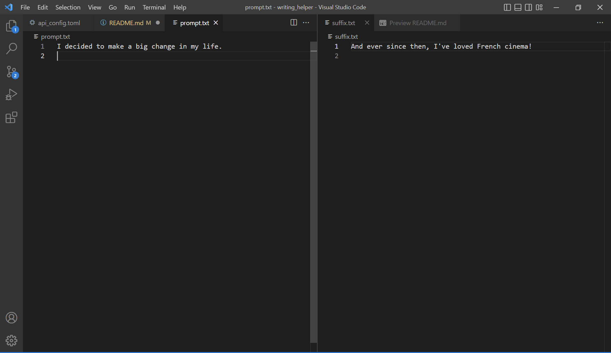
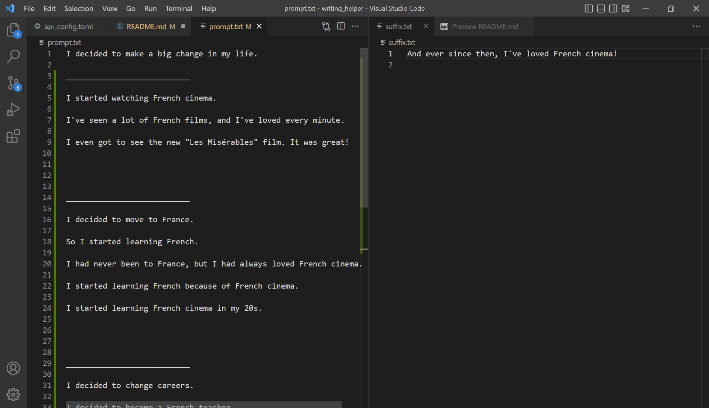

# writing_helper

Generate GPT-3 text completions quickly using an executable wrapper for the OpenAI GPT-3 Completions API, two text files, and a config file.

This tool requires the user to have their own OpenAI api key stored as an environment variable with the default name "OPEN_API_ACCESS_KEY". The environment variable name can be modified in the api_config.toml configuration file.

You are responsible to adhering to OpenAI's Terms of Use (see below).

## Why I made it

I was experimenting with the public API for GPT-3, primarily using it to assist in writing financial blog articles at [Luther Wealth Management](http://www.lutherwealth.com).

I settled into the following workflow:

1. Run a Completions API request with a prompt such as "Write a long blog article about Roth IRA accounts."
2. Edit the response text.
3. Choose an insertion point where I want GPT-3 to add some additional content.
4. Cut everything following the insertion point, which becomes my suffix for the next step.
5. Append a hint for GPT-3 to the end of the remaining text, such as "Roth IRAs also have several advantages when it comes to inherited investment accounts, such as"
6. Run the Completions API again, submitting both the prompt and suffix.
7. Edit the completed content, trimming down the inserted text as necessary.
8. Repeat 3-7 until I've got a full blog article.

I made this to remove the steps of copy-pasting chunks of text into the OpenAI sandbox, or into API submission requests, so that I could just work with two text files as I iteratively compose the blog article with GPT-3.

## Install

### Binaries

None included yet.

### Building from source

Run

```shell
git clone https://github.com/justinluther502/writing_helper.git
cd writing_helper
cargo build --release
```

to run the application, drop the following 4 files anywhere in the same directory:

- prompt.txt
- suffix.txt
- api_config.toml
- writing_helper exectuable

Then enter a prompt in prompt.txt, and an optional suffix. 



Run the executable, and upon completion, a few choices of GPT-3 generated completions should be inserted into prompt.txt, along with the optional suffix. Pick what you like, and iterate until you have the content you want!



### Run via Cargo from repository root

You can also run directly from the repository directory using the root files and running

```shell
cargo run
```

## Compliance

Please refer to the OpenAI Terms of Use. This tool requires using your own API key.

https://openai.com/api/policies/terms/
